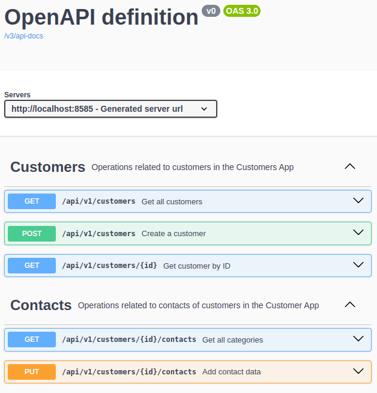

# Customer CRUD Application

## Описание
Customer CRUD Application - это CRUD приложение, с БД PostgreSQL. Содержит 2 сущности Customers, Contacts. Позволяет манипулировать сущностями Customers и контактными данными.

## Эндпоинты
- **Customer Service**: Управление кастомерами и их контактами.
  - http://localhost:8585/swagger/swagger-ui/index.html

## Технологии
- Spring Boot
- PostgreSQL
- Liquibase/PreLiquibase
- Docker, DockerCompose

### Запуск
1. Отредактировать файл docker-compose.yml при необходимости.
2. Запустить контейнер:
```
docker-compose up --build
```
